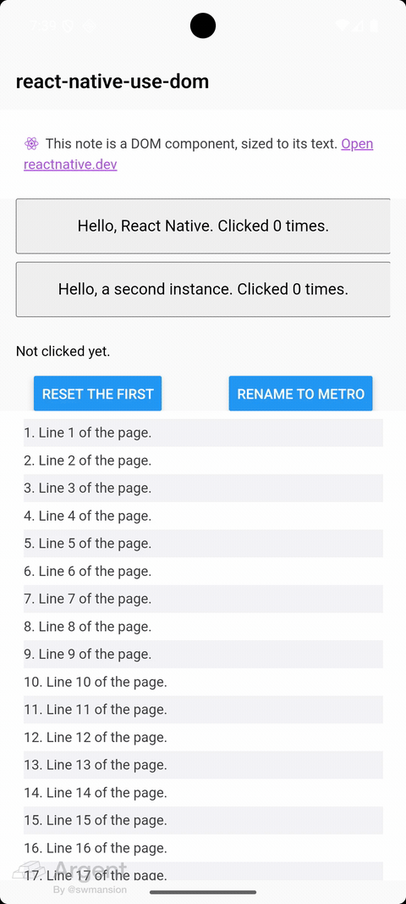
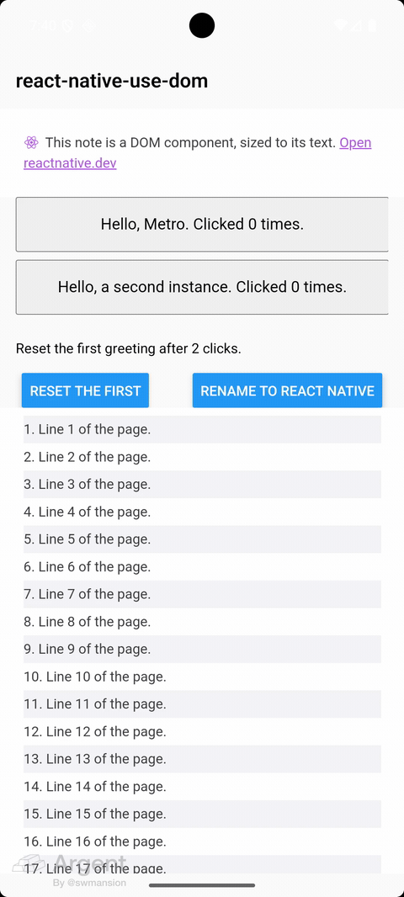

# react-native-use-dom

Render React DOM components inside React Native with the `'use dom'` directive, without Expo.

A module marked `'use dom'` runs in a native web view on iOS and Android, and native code renders it like any
other component: props go in, function props become native actions the component can await, and methods it
exposes are reachable through a `ref`. Release builds embed every page, so components load offline.

<p align="center">
	
	&nbsp;&nbsp;&nbsp;
	
</p>
<p align="center"><sub>Function props, ref methods and props cross the bridge in both directions · Fast Refresh keeps the component's state</sub></p>

- **Use it:** [the package README](./packages/react-native-use-dom/README.md), then the [guide](./docs/README.md).
- **Errors:** [docs/errors.md](./docs/errors.md) explains every `ERR_USE_DOM_*` code.
- **Coding agents:** [`AGENTS.md`](./packages/react-native-use-dom/AGENTS.md) has the rules in one page.

## Repository

| Path                                                               | What it holds                                                       |
| ------------------------------------------------------------------ | ------------------------------------------------------------------- |
| [`packages/react-native-use-dom`](./packages/react-native-use-dom) | the library: Babel plugin, Metro integration, runtimes, native view |
| [`examples/bare`](./examples/bare)                                 | a React Native Community CLI app, without Expo                      |
| [`examples/expo`](./examples/expo)                                 | an Expo app with a development build                                |
| [`docs`](./docs)                                                   | the user guide                                                      |

## Develop

From a clean checkout, with Node.js 22.12 or newer:

```sh
corepack enable          # provides the pnpm version in package.json's packageManager
pnpm install
pnpm exec lefthook install
pnpm build
```

Run the checks CI runs. [zizmor](https://docs.zizmor.sh/installation/) audits the workflows:

```sh
pnpm lint
pnpm format:check
pnpm typecheck
pnpm test
zizmor .github
```

The tests need no simulator or device: they run Metro, Babel and both runtimes in-process.

Run the example apps on a simulator or device, which needs the
[React Native environment](https://reactnative.dev/docs/set-up-your-environment) for each platform. Each README
has the steps, for development and release builds:

- [Bare React Native](./examples/bare/README.md#run-it)
- [Expo](./examples/expo/README.md#run-it)

The examples use the library from the workspace, through its build: run `pnpm build` again after changing it.

[CONTRIBUTING.md](./CONTRIBUTING.md) covers the git hooks, commit messages, type tests and generated docs.

## License

[MIT](./LICENSE)
